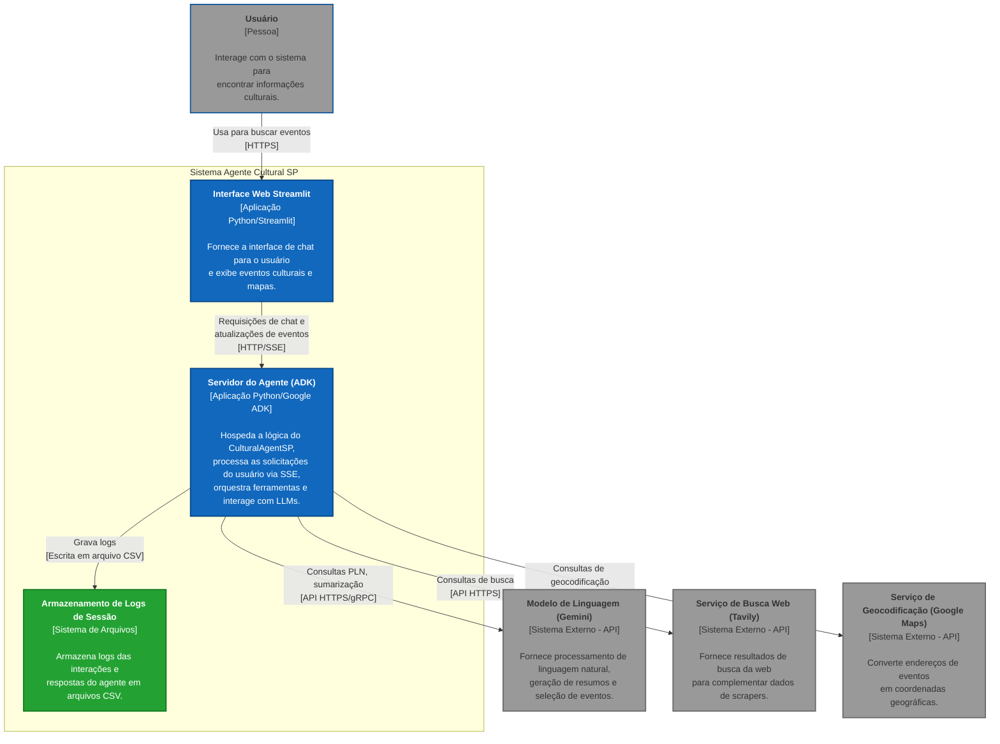
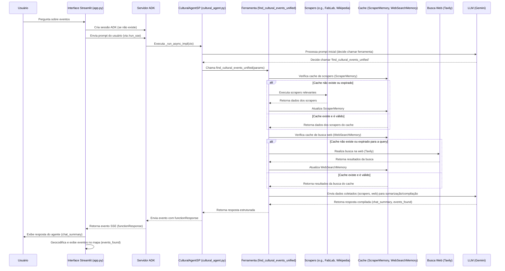

# Agente Cultural para a cidade de São Paulo AI Tinkerers SP

## AI Tinkerers SP

AI Tinkerers São Paulo é o capítulo local da rede global AI Tinkerers, dedicada a reunir desenvolvedores, engenheiros e pesquisadores que constroem soluções práticas com IA generativa e modelos fundacionais. Com foco na experimentação técnica e no compartilhamento de conhecimento, o grupo promove meetups, workshops e hackathons na cidade de São Paulo, conectando a comunidade local com as tendências globais em inteligência artificial.
- Visão: “Construindo o futuro da IA em São Paulo, juntos.” 
- Missão: "Conectar e fortalecer a comunidade de desenvolvedores, engenheiros, pesquisadores e empreendedores de IA em São Paulo, promovendo a experimentação prática e o compartilhamento de conhecimento em aplicações inovadoras de IA generativa."

## Visão Geral
Este projeto implementa um agente conversacional especializado em encontrar eventos culturais, museus, oficinas e atividades de lazer voltadas para o público infanto-juvenil na cidade de São Paulo. 
O agente utiliza o Google Agent Development Kit (ADK) e integra diversas ferramentas, incluindo scrapers web, busca na web com Tavily, e modelos de linguagem Gemini para processamento e resposta. A interação com o agente é facilitada por uma interface web construída com Streamlit.

## Funcionalidades Principais
-   **Busca Inteligente de Eventos**: Compreende linguagem natural para buscar eventos por tipo, data e localização.
-   **Fontes de Dados Diversificadas**: Coleta informações de múltiplos sites através de scrapers customizados (FabLab Livre SP, Visite São Paulo, Wikipédia Museus) e busca na web.
-   **Geocodificação e Visualização em Mapa**: Eventos encontrados são geocodificados e exibidos em um mapa interativo na interface.
-   **Interface de Chat Amigável**: Permite uma conversa fluida com o agente através de uma interface Streamlit.
-   **Logging Detalhado**: Registra interações e respostas em arquivos CSV por sessão para depuração e análise.
-   **Configurável**: Chaves de API e modelo de LLM são gerenciados através de um arquivo `config.yaml`.

## Arquitetura do Projeto
O diagrama abaixo ilustra os principais componentes do sistema e como eles interagem:



## Fluxo Lógico da Consulta do Agente
O diagrama abaixo detalha como uma consulta do usuário é processada pelo sistema:



### Estrutura de Arquivos do Projeto (Visão em Árvore)

```text
smart-places-children-and-teenagers-SP/
├── .git/                     # Metadados do Git
├── .gitignore                # Arquivos e diretórios ignorados pelo Git
├── README.md                 # Este arquivo de documentação principal
├── requirements.txt          # Dependências Python do projeto
├── agents/                   # Código fonte principal do agente
│   ├── __init__.py           # Inicializador do pacote agents, expõe o agente para o ADK
│   ├── agents.md             # Documentação da estrutura e componentes principais de agents/
│   ├── config.yaml           # Configurações (chaves de API, modelo LLM)
│   ├── cultural_agent.py     # Definição principal do CulturalAgentSP
│   ├── prompts.py            # Prompts e instruções para o LLM
│   ├── logs_sessions/        # Diretório para logs CSV de sessão (criado em execução)
│   ├── scrapers/             # Módulos de scraping web
│   │   ├── __init__.py
│   │   ├── fablab_scraper.py
│   │   ├── scrapers.md       # Documentação dos scrapers
│   │   ├── visite_sao_paulo_scraper.py
│   │   └── wikipedia_museus_scraper.py
│   ├── state/                # Módulos de gerenciamento de estado e cache
│   │   ├── __init__.py
│   │   ├── macro_state.py
│   │   └── state.md          # Documentação do gerenciamento de estado
│   ├── tools/                # Ferramentas utilizadas pelo agente
│   │   ├── __init__.py
│   │   ├── cultural_event_finder.py
│   │   ├── data_aggregator.py
│   │   ├── get_bairros.py
│   │   ├── get_user_response.py
│   │   ├── search_web.py
│   │   └── tools.md          # Documentação das ferramentas
│   └── utils/                # Módulos utilitários
│       ├── __init__.py
│       ├── config.py
│       ├── date_utils.py
│       ├── env_setup.py
│       ├── logger.py
│       ├── logger_session_csv.py
│       ├── maps.py
│       └── utils.md          # Documentação dos utilitários
├── interface/                # Código da interface do usuário Streamlit
│   ├── app.py                # Aplicação principal da interface
│   └── interface.md          # Documentação da interface
└── tests/                    # Testes unitários
    ├── __init__.py
    ├── test_agents.py
    ├── test_scrapers.py
    ├── test_tools.py
    ├── test_utils.py
    └── tests.md              # Documentação dos testes automatizados
```

## Estrutura do Projeto e Documentação Detalhada

O projeto é organizado nos seguintes diretórios principais:

*   **`/agents`**: Contém toda a lógica do agente, ferramentas, scrapers, utilitários e configurações.
    *   **Documentação Geral do Agente e Componentes Principais**: [`agents/agents.md`](./agents/agents.md)
    *   **`/agents/utils`**: Módulos utilitários (logging, config, datas, etc.).
        *   **Documentação**: [`agents/utils/utils.md`](./agents/utils/utils.md)
    *   **`/agents/tools`**: Ferramentas que o agente utiliza (busca de eventos, agregação de dados).
        *   **Documentação**: [`agents/tools/tools.md`](./agents/tools/tools.md)
    *   **`/agents/state`**: Gerenciamento de estado e cache.
        *   **Documentação**: [`agents/state/state.md`](./agents/state/state.md)
    *   **`/agents/scrapers`**: Scrapers para coleta de dados de sites específicos.
        *   **Documentação**: [`agents/scrapers/scrapers.md`](./agents/scrapers/scrapers.md)
    *   **`/agents/logs_sessions`**: Diretório onde os logs CSV das sessões são salvos (criado em tempo de execução).

*   **`/interface`**: Contém a aplicação da interface do usuário.
    *   `app.py`: Aplicação Streamlit para interagir com o agente.
    *   **Documentação**: [`interface/interface.md`](./interface/interface.md)

*   **`/tests`**: Contém os testes unitários para os diversos componentes do projeto.
    *   **Documentação**: [`tests/tests.md`](./tests/tests.md)

*   **`requirements.txt`**: Lista as dependências Python do projeto.
*   **`README.md`**: Este arquivo.


## Configuração e Instalação

Siga os passos abaixo para configurar e executar o projeto localmente:

1.  **Clone o Repositório**:
    ```bash
    git clone <URL_DO_REPOSITORIO>
    cd smart-places-children-and-teenagers-SP
    ```

2.  **Crie e Ative um Ambiente Virtual**:
    Recomendado para isolar as dependências do projeto.
    ```bash
    python -m venv venv
    source venv/bin/activate  # No Linux/macOS
    # venv\Scripts\activate   # No Windows
    ```

3.  **Instale as Dependências**:
    Todas as bibliotecas Python necessárias estão listadas no arquivo `requirements.txt`.
    ```bash
    pip install -r requirements.txt
    ```
    Pode ser necessário instalar o `playwright` e seus navegadores se ainda não estiverem configurados (usado por alguns scrapers ou para funcionalidades futuras):
    ```bash
    playwright install
    ```

4.  **Configure as Chaves de API**:
    *   Renomeie ou copie o arquivo `agents/config.example.yaml` (se existir) para `agents/config.yaml`.
    *   Edite `agents/config.yaml` e insira suas chaves de API válidas para:
        *   `google_maps`: (Opcional para a funcionalidade atual, mas o scraper de mapas pode precisar)
        *   `gemini_api_key`: Chave da API do Google Gemini.
        *   `tavily_api_key`: Chave da API do Tavily.
    *   Você também pode configurar o `model_name` do LLM nesta seção, se desejar.
    *   **Importante**: Não adicione o arquivo `config.yaml` com suas chaves reais ao controle de versão (Git).

## Como Executar a Aplicação

Para interagir com o agente, você precisa iniciar dois componentes: o servidor do Agente ADK e a interface Streamlit.

1.  **Inicie o Servidor do Agente ADK**:
    No terminal, a partir do diretório raiz do projeto (`smart-places-children-and-teenagers-SP`), execute:
    ```bash
    adk web
    ```
    Isso iniciará o servidor ADK, geralmente em `http://localhost:8000`. Você verá logs no console indicando que o servidor está rodando e que o `CulturalAgentSP` foi carregado.

2.  **Inicie a Interface Streamlit**:
    Em um **novo terminal** (com o ambiente virtual ativado), a partir do diretório raiz do projeto, execute:
    ```bash
    streamlit run interface/app.py
    ```
    Isso abrirá a interface web no seu navegador, geralmente em `http://localhost:8501`. Você poderá então conversar com o agente através desta interface.


## Organização Interna do Código e Testes

Para garantir a clareza, manutenibilidade e facilidade de desenvolvimento, os arquivos de código Python (`.py`) e os arquivos de teste seguem certas convenções de organização e documentação:

### Comentários e Documentação Interna nos Arquivos `.py`

Cada arquivo Python no projeto é estruturado para ser o mais legível e auto-documentado possível:

*   **Docstrings de Módulo**: Todo arquivo `.py` inicia com uma `docstring` (uma string multilinha entre aspas triplas `"""..."""`) que descreve o propósito geral do módulo, seus principais componentes e, se aplicável, como ele se encaixa no sistema maior.
*   **Docstrings de Classe e Função**: Todas as classes e funções públicas, e muitas das internas importantes, possuem `docstrings` que explicam:
    *   O que a classe ou função faz.
    *   Os argumentos que ela aceita (com tipos, quando relevante).
    *   O que ela retorna (com tipos, quando relevante).
    *   Quaisquer exceções que pode levantar.
*   **Organização Lógica Interna**:
    *   **Imports**: Agrupados no início do arquivo, geralmente divididos entre bibliotecas padrão, bibliotecas de terceiros e módulos locais do projeto.
    *   **Constantes**: Definidas após os imports, se houver.
    *   **Funções e Classes**: O corpo principal do módulo, com funções e classes logicamente agrupadas.
    *   **Seções Comentadas**: Em arquivos maiores ou mais complexos, blocos de comentários (ex: `# ============================`, `# --- Seção de Configuração ---`) são usados para delimitar e nomear seções lógicas dentro do código, melhorando a navegabilidade.
*   **Comentários em Linha**: Usados com moderação para explicar trechos de código que podem não ser imediatamente óbvios ou para destacar decisões de implementação importantes.

### Estrutura para Execução Individual de Testes

Os arquivos de teste no diretório `tests/` (como `test_utils.py`, `test_scrapers.py`, etc.) são projetados para serem executados tanto como parte de uma suíte completa (usando `pytest`, por exemplo) quanto individualmente.

*   **Cláusula `if __name__ == '__main__':`**: Cada arquivo de teste contém uma seção no final, tipicamente:
    ```python
    if __name__ == '__main__':
        # Código para configurar e executar os testes definidos no arquivo
        success = run_all_specific_tests() # Ou chamada direta ao unittest.main()
        print(f"Sucesso dos testes em {__file__}: {success}")
        sys.exit(0 if success else 1)
    ```
*   **Benefícios**:
    *   **Desenvolvimento Focado**: Permite que um desenvolvedor execute apenas os testes relevantes para o módulo em que está trabalhando, agilizando o ciclo de feedback.
    *   **Depuração**: Facilita a depuração de falhas de teste, isolando a execução.
*   **Logs Detalhados**: Conforme mencionado na documentação de `tests/tests.md`, cada módulo de teste também configura o logging para registrar resultados detalhados em arquivos `.log` específicos (ex: `tests/test_utils.log`), o que é útil tanto para execuções individuais quanto para a suíte completa.


## Autores e Agradecimentos

*   **Criador Principal**: [Thiago Nobre Mascarenhas/AI Tinkerers SP]
*   **Contribuidores**: Agradecemos a todos que dedicam seu tempo para melhorar este projeto! Os contribuidores serão listados aqui à medida que seus Pull Requests forem aceitos.

## Contribuição

Agradecemos o seu interesse em contribuir para o Agente Cultural SP! Existem várias maneiras de ajudar:

*   **Reportando Bugs**: Se encontrar um bug, por favor, abra uma issue detalhando o problema, como reproduzi-lo e o comportamento esperado versus o observado.
*   **Sugerindo Funcionalidades**: Tem ideias para novas funcionalidades ou melhorias? Abra uma issue para discutir sua sugestão.
*   **Enviando Pull Requests**: Se deseja contribuir com código, ficaremos felizes em revisar seu Pull Request (PR).

### Política para Pull Requests (PRs)

Para garantir a qualidade e a colaboração eficaz, pedimos que os Pull Requests sigam estas diretrizes:

1.  **Crie uma Issue Primeiro**: Para contribuições significativas (novas funcionalidades, grandes refatorações), por favor, abra uma issue primeiro para discutir a mudança proposta. Isso garante que estamos alinhados antes que o trabalho de desenvolvimento comece. Para correções de bugs menores, um PR direto é aceitável.
2.  **Fork e Branch**:
    *   Faça um fork do repositório.
    *   Crie uma nova branch descritiva para sua alteração (ex: `feature/nova-busca-avancada` ou `fix/erro-geocodificacao`).
3.  **Desenvolvimento**:
    *   Escreva um código claro, conciso e bem comentado.
    *   Siga as convenções de estilo e organização do projeto existentes (conforme descrito na seção "Organização Interna do Código e Testes").
4.  **Testes**:
    *   **Novas Funcionalidades**: Devem incluir testes unitários ou de integração que cubram a nova lógica.
    *   **Correções de Bugs**: Idealmente, inclua um teste que demonstre o bug e verifique se o PR o corrige.
    *   **Todos os Testes Devem Passar**: Certifique-se de que todos os testes existentes e os novos testes da sua branch estão passando (`pytest tests/`) antes de submeter o PR.
5.  **Documentação**:
    *   Atualize a documentação relevante (`README.md`, documentação interna dos arquivos `.md` nos subdiretórios, docstrings) se suas alterações impactarem a forma como o projeto é usado, configurado ou entendido.
6.  **Mensagens de Commit Claras**: Use mensagens de commit claras e descritivas.
7.  **Submissão do PR**:
    *   Envie o Pull Request para a branch principal (geralmente `main` ou `master`) do repositório original.
    *   No seu PR, descreva claramente as alterações feitas e referencie qualquer issue relacionada (ex: "Corrige #123").
8.  **Revisão e Colaboração**:
    *   Esteja aberto a feedback e discussões durante o processo de revisão.
    *   Mantenha uma comunicação respeitosa e construtiva. Não toleramos desrespeito ou comportamento inadequado.
9.  **Manutenção do PR**: Se forem solicitadas alterações, faça os commits na sua branch e o PR será atualizado automaticamente.

Agradecemos antecipadamente por suas contribuições!

## Licença
Este projeto é distribuído sob a licença MIT. Veja o arquivo [LICENSE](LICENSE) para mais detalhes.
